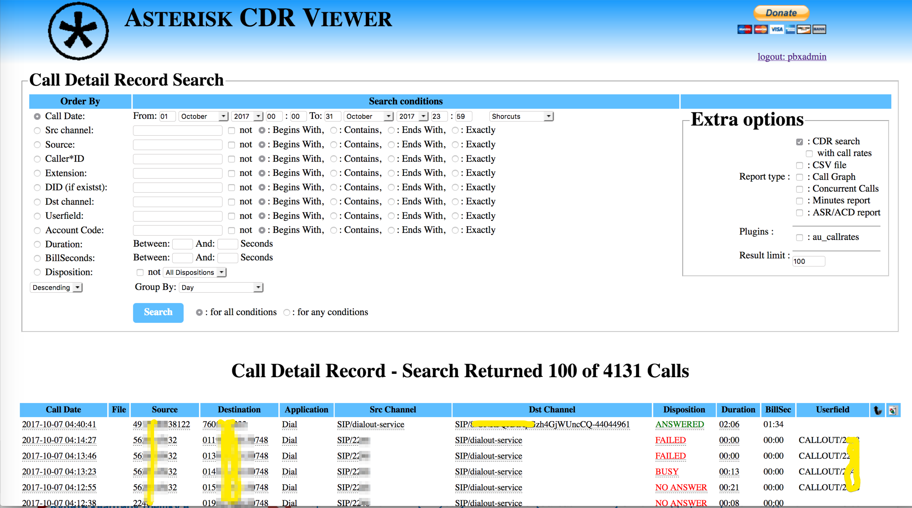
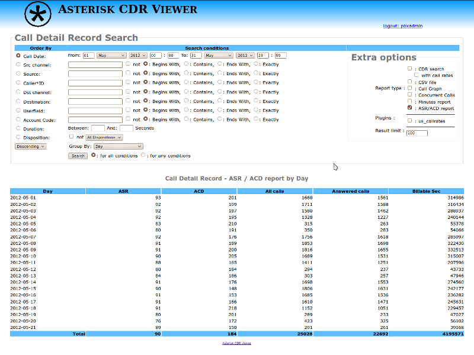
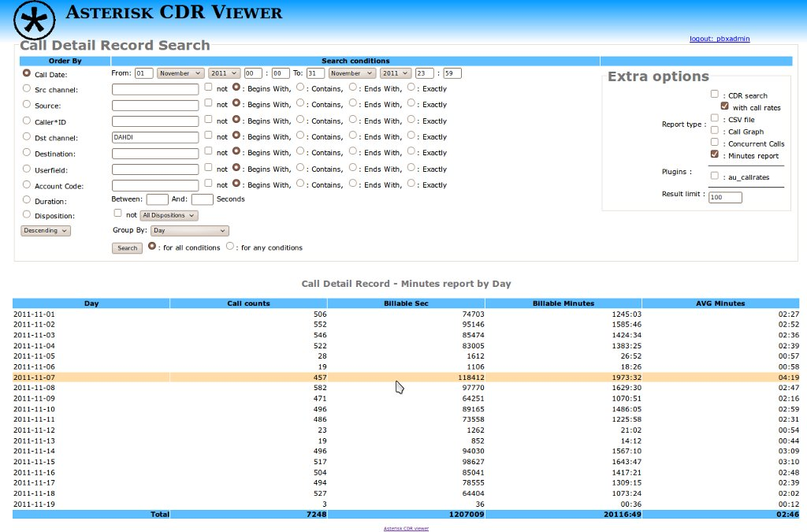
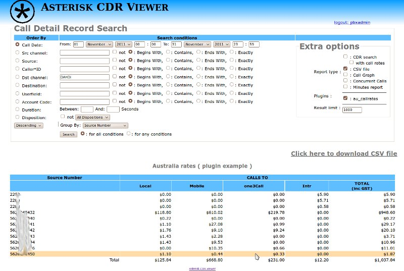

Simple and fast viewer for asterisk CDRs / recordings. ( 1.0.14, Oct 7 2017 )

    Asterisk regexp support ( like _XNZ. ) for source / destination / DID numbers. 

    PHP without any additional dependencies. 

    Easy to install and use. 

    CSS based. 

    User / Admin mode 

    Plugins support for custom reports. 

    ASR report 

( from http://code.google.com/p/asterisk-cdr-viewer )
